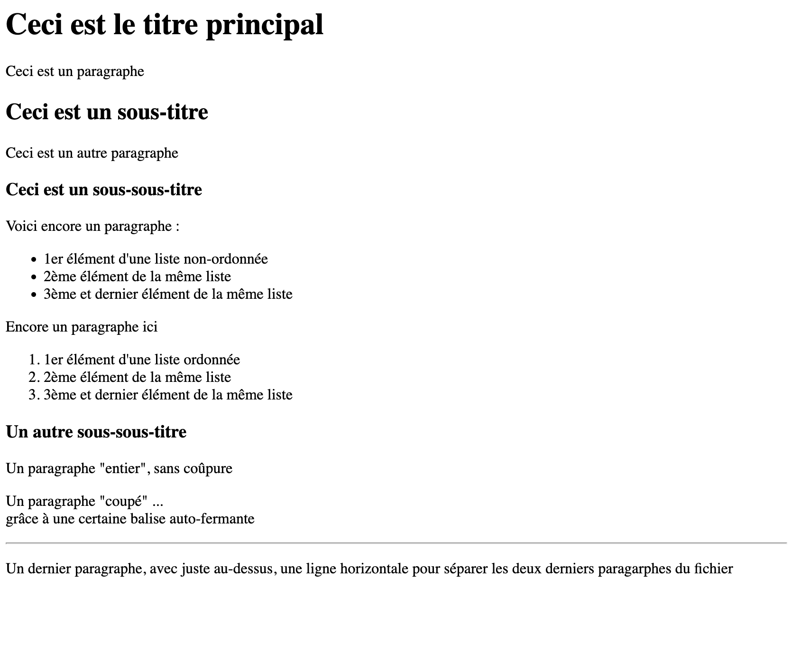

---
tags:
  - btech
  - session-45
  - exercise
---

# Jour 1 : HTML basics

## Exercice 1

- Dans ce dossier "exercice-1", ajoutez un fichier **index.html** et reproduisez le résultat de la capture d'écran ci-dessous :
  

### Conseils

- Codez petit-à-petit, en (re)lisant les consignes, sans vous presser

- Le texte de la capture d’écran indique le type de balise à utiliser (ex. "Ceci est un paragraphe" → il faut un paragraphe qui s'écrit 
...
)

- Inutile de recopier le texte parfaitement, mais respectez le bon nombre de balises

- Testez votre code directement sur Google Chrome pour vérifier qu'il fonctionne correctement

- Vous devrez trouver par vous-même comment ajouter une ligne horizontale en HTML (checkez la documentation [MDN](https://developer.mozilla.org/fr/docs/Web/HTML))

- Si vous êtes bloqué plus de 15 minutes, demandez de l’aide : c’est normal dans l’apprentissage !