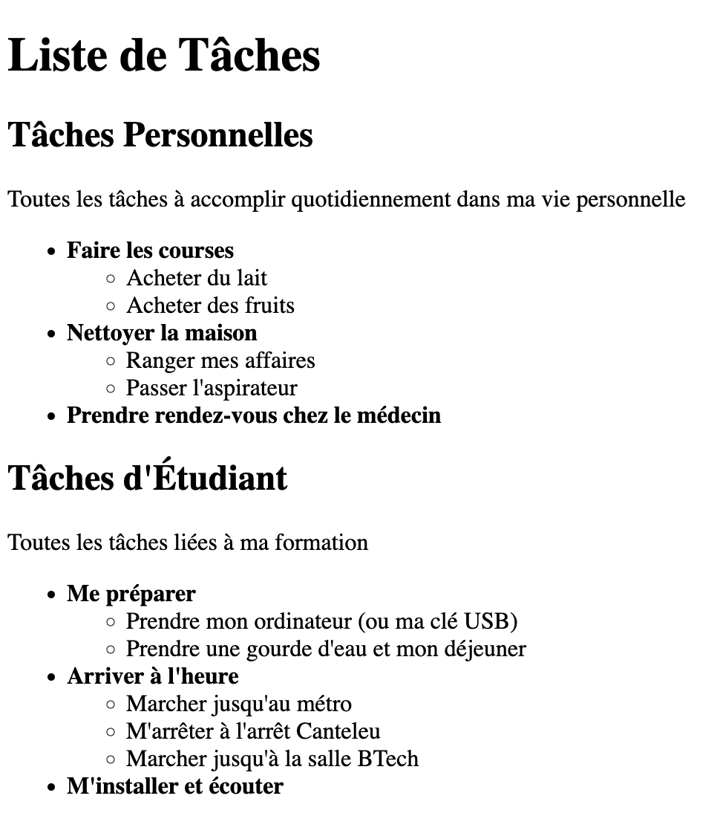

---
tags:
  - btech
  - session-45
  - exercise
---

# Jour 1 : HTML basics

## Exercice 2 bonus

- Dans ce dossier "exercice-2-bonus", ajoutez un fichier **index.html** :
  - reprenez le code de votre "exercice-2"
  - remplacez la liste principale non-ordonnée ("Faire les courses", "Nettoyer la maison", etc...) par une liste ordonnée
  - les sous-liste doivent rester des listes non-ordonnées

### Conseils

- Vous ne connaissez que les listes non-ordonnées pour le moment ? Serez-vous surpris si on vous conseille alors de checker [la documentation](https://developer.mozilla.org/fr/docs/Web/HTML) ? 😁
