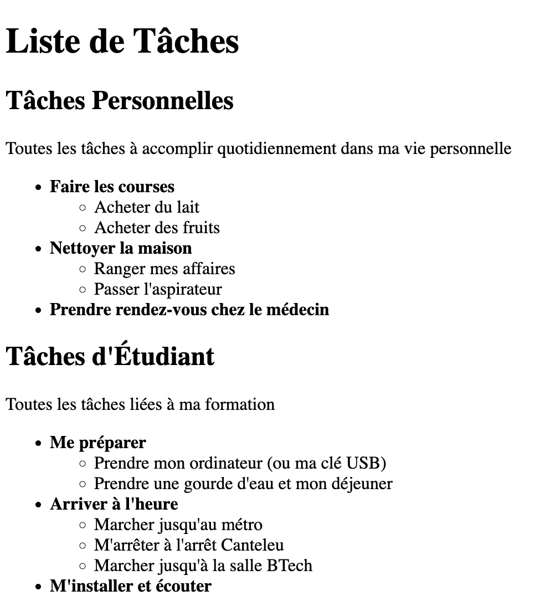

---
tags:
  - btech
  - session-45
  - exercise
---

# Jour 1 : HTML basics

## Exercice 2

- Dans ce dossier "exercice-2", ajoutez un fichier **index.html** :
  - sous chaque sous-titre principal, ajoutez une liste non ordonnée de tâches
  - certaines tâches peuvent elles-mêmes contenir des sous-tâches sous forme de listes imbriquées (voir résultat ci-dessous)

### Conseils

- Un peu perdu avec l'imbrication ? Pensez toujours à checker [la documentation](https://developer.mozilla.org/fr/docs/Web/HTML), à regarder les exemples et **à les comprendre** avant de copier/coller du code trouvé sur le net

- Les éléments de la liste principale ("Faire les courses", "Nettoyer la maison", etc.) ne sont pas des titres mais sont simplement **en gras** ; cherchez la balise HTML qui le permet !

- Vous allez remarquer un exercice bonus avec le même nom que cet exercice ("exercice-2-bonus") : ne faîtes les bonus que lorsque vous avez terminez tous les autres exercices non-bonus !
