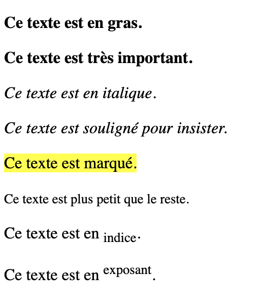

---
tags:
  - btech
  - session-45
  - exercise
---

# Jour 1 : HTML basics

## Exercice 3

Dans ce dossier "exercice-3", ajoutez un fichier **index.html** où vous devez ensuite formatter les différents éléments de texte en utilisant les balises HTML appropriées.

### Conseils

- Vous pouvez ajouter les balises demandées directement dans les paragraphes donnés dans le fichier **index.html** ; n'utilisez aucune solution impliquant du CSS !

- Il y a une différence entre "mettre en gras" et "rendre important", idem pour "mettre en italique" et "insister" : à vous de chercher et de trouver quelles balises utiliser dans ces 4 cas-là !
