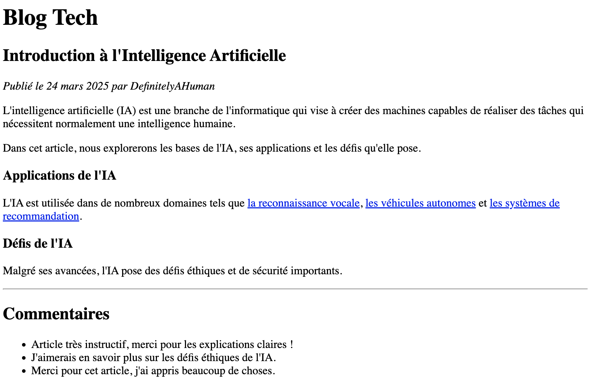

---
tags:
  - btech
  - session-45
  - exercise
---

# Jour 1 : HTML basics

## Exercice 4 bonus

- Dans ce dossier "exercice-4-bonus", ajoutez un fichier **index.html** :
  - reprenez le code de votre "exercice-4"
  - remplacez les éléments en surbrillance ("la reconnaissance vocale", "les véhicules autonomes", etc...) par des liens menant vers une page Wikipédia en rapport avec le texte

### Conseils

- Les textes comme "la reconnaissance vocale" devrait donc amener à une page Wikipédia sur la reconnaissance vocale ; faites-en autant pour les deux autres liens

- Nous n'avons pas encore vu comme créer des liens : checkez [la documentation](https://developer.mozilla.org/fr/docs/Web/HTML) et découvrez en avance les **attributs** !
