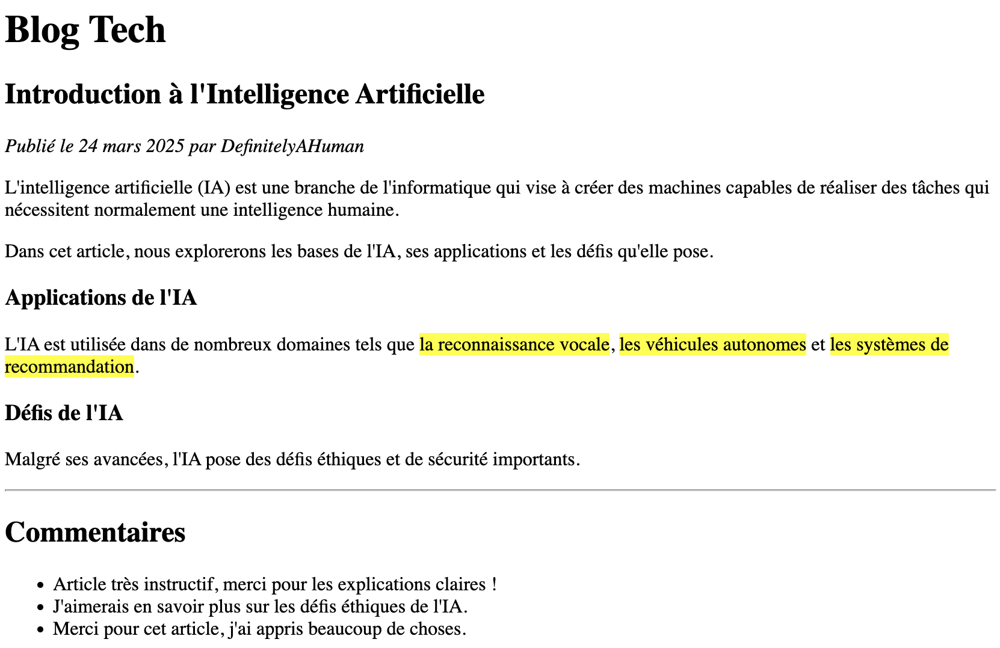

---
tags:
  - btech
  - session-45
  - exercise
---

# Jour 1 : HTML basics

## Exercice 4

Dans ce dossier "exercice-4", ajoutez un fichier **index.html** et reproduisez la capture d'écran ci-après :

### Conseils

- La surbrillance en jaune des éléments vient d'une balise spéciale ; n'utilisez en aucun cas du CSS !

- La largeur de l'écran, sur la capture d'écran, a été réduite pour vous permettre de mieux voir. Vous n'avez pas à changer la largeur de votre écran.
